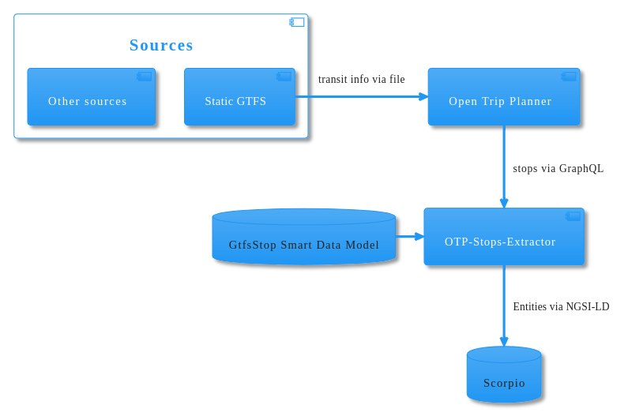

# otp-stops-extractor

## Purpose

As part of the ODALA mobility dashboard it's important to have the local
public transport stops available in a NGSI-LD compatible broker in a standard format.

## Architecture

## Data model

The chosen model is the GTFSStop

https://github.com/smart-data-models/dataModel.UrbanMobility/tree/master/GtfsStop

## Deployment

The application is meant to be run as a Kubernetes job, see `deployment/stops-extractor.yaml`.
No need for a bundle of any kind, change config.yaml to your environment and apply all the files in `deployment`

## License

for the ODALA project.

© 2023 Phoops

License EUPL 1.2

The contents of this publication are the sole responsibility of the authors and do not necessarily reflect the opinion of the European Union.
This project has received funding from the European Union’s “The Connecting Europe Facility (CEF) in Telecom” programme under Grant Agreement number: INEA/CEF/ICT/A2019/2063604
